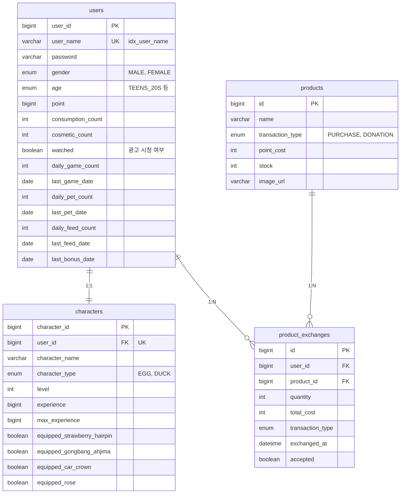

# 마을레벨업 : 마스코트 키우기

> 마스코트 성장과 지역 미션을 결합한 지역 방문 유도형 게임 서비스


KDT 해커톤 지역 균형 발전 지정과제 · 2025.06 ~ 2025.09 
팀 로컬프렌즈 · 클라이언트 1, 백엔드 1, 기획 2, 디자인 2

**고용노동부 장관상** (전국 60개 팀 중 수상)

| 저장소 | 설명 |
|---|---|
| [Server](https://github.com/KDT-LocalFriends/Server) | Spring Boot 도메인 서버 — 인증 · 캐릭터 · 상점 · 포인트 · 기부 |
| [Chat](https://github.com/KDT-LocalFriends/Chat) | FastAPI 추천 서버 — RAG 기반 김해 관광 추천 |

---

## 목차

- [서비스 소개](#서비스-소개)
- [기술 스택](#기술-스택)
- [아키텍처](#아키텍처)
- [ERD](#erd)
- [API 명세](#api-명세)
- [개발 내용](#개발-내용)
- [실행 방법](#실행-방법)
- [프로젝트 구조](#프로젝트-구조)
- [기술적 의사결정](#기술적-의사결정)

---

## 서비스 소개

새로운 국내 여행지를 가고 싶어도 정보가 분산되어 있고 신뢰할 기준이 없어 결정을 미루는 2030이 많습니다. 국내여행 불만족 요인 1위는 관광지 물가(45.1%), 2위는 특색 콘텐츠 부족(19.4%)으로, 정보를 더 많이 제공하는 것만으로는 해결되지 않는 구조입니다. 방문할 이유와 방문했을 때의 보상을 게임 루프 안에 넣는 방향으로 서비스를 설계했습니다.

**핵심 기능**

| 기능 | 설명 |
|---|---|
| 마스코트 성장 | 쓰다듬기·먹이주기·미니게임으로 경험치를 쌓아 레벨업, 지역 IP 코스튬 착용 |
| AI 관광 추천 | 김해시 공식 데이터를 근거로 관광지·축제·음식점 추천 |
| 포인트 경제 | 충전과 광고 시청으로 포인트를 얻고, 상점에서 소비형·치장형 아이템 구매 |
| 지역 기부 | 포인트로 지역에 기부하고 내역 확인 |

---

## 기술 스택

**Backend**

| 분류 | 사용 기술 |
|---|---|
| Language / Framework | Java 21, Spring Boot 3.5.4 |
| Persistence | Spring Data JPA, PostgreSQL |
| Security | Spring Security, JJWT 0.11.5 (JWT + HttpOnly Cookie) |
| Test | JUnit5, Testcontainers |
| Docs | Swagger (springdoc-openapi 2.8.0) |
| Etc | Lombok, MapStruct, WebFlux, Jackson |

**AI — 추천 서버**

| 분류 | 사용 기술 |
|---|---|
| Language / Framework | Python, FastAPI |
| LLM | OpenAI `gpt-4o-mini` |
| Reranker | `BAAI/bge-reranker-large` (transformers, torch) |
| Cache | Redis |

**Client**

Unity (Android)

**Infra**

AWS EC2

**External**

김해시 공식 OpenAPI (관광지 / 축제 / 음식점) · OpenAI API

---

## 아키텍처

`[아키텍처 구성도]`

Unity 클라이언트가 Spring Boot 서버로 요청하고, 추천 요청은 Spring Boot가 FastAPI 추천 서버로 위임합니다. 도메인 로직과 추천 파이프라인을 분리해 각각 독립적으로 배포합니다.

```
Unity (Android)
      │
      ▼
Spring Boot ──────► FastAPI ──────► OpenAI API
 인증·포인트·상점      추천 파이프라인   BGE-Reranker
      │                   │
      ▼                   ▼
 PostgreSQL            Redis (추천 결과 캐시)
```

---

## ERD


 
테이블은 4개뿐입니다. 아이템·충전 상품·캐릭터 카탈로그는 테이블이 아니라 **enum으로 관리**했습니다.
 
```java
public enum ShopItemType {
    PERSIMMON("단감", ItemType.CONSUMPTION, "🍊", 100),
    STRAWBERRY_HAIRPIN("딸기 헤어핀", ItemType.COSMETIC, "🍓", 100),
    ...
}
```
 
해커톤 기간 동안 아이템 종류는 고정이었고 운영자가 추가할 경로도 없었습니다. 테이블로 두면 매번 시드 데이터와 마이그레이션이 따라붙는데, enum이면 컴파일 타임에 오타가 잡히고 카탈로그 변경이 한 파일 수정으로 끝납니다. 대신 **런타임 아이템 추가가 불가능하다는 비용**을 받아들인 선택입니다. 실제 운영 서비스라면 테이블로 가야 합니다.
 
사용자가 보유한 아이템 수량을 `users` 테이블의 컬럼으로 편 것도 같은 맥락입니다. 아이템 종류가 6종으로 고정이라 조인 없이 한 행으로 읽히는 이점을 택했고, 종류가 늘어나는 순간 스키마 변경이 필요해지는 구조라는 점은 인지하고 있습니다.

---

## API 명세
 
**인증 · 회원** `/v1/users/register`
 
| Method | Path | 설명 |
|---|---|---|
| POST | `/signup` | 회원가입 |
| POST | `/login` | 로그인 (JWT 발급 + HttpOnly Cookie) |
| POST | `/logout` | 로그아웃 |
| GET | `/{userId}` | 사용자 조회 |
| GET | `/me` | 내 정보 조회 |
 
**캐릭터** `/api/characters`
 
| Method | Path | 설명 |
|---|---|---|
| GET | `/{userId}` | 캐릭터 조회 |
| POST | `/pet` | 쓰다듬기 (경험치 +20) |
| POST | `/feed` | 먹이주기 (소모품 1 소비, 경험치 +20) |
| POST | `/game` | 미니게임 완료 (경험치 +50, 3회째 +20) |
| GET | `/remaining-pets` | 남은 쓰다듬기 횟수 |
| GET | `/remaining-feeds` | 남은 먹이주기 횟수 |
| POST | `/equip` | 코스튬 착용 |
| POST | `/unequip` | 코스튬 해제 |
 
**상점** `/api/shop`
 
| Method | Path | 설명 |
|---|---|---|
| GET | `/items` | 전체 아이템 목록 |
| GET | `/items/category/{category}` | 카테고리별 아이템 |
| GET | `/items/consumption` | 소모형 아이템 |
| GET | `/items/cosmetic` | 치장형 아이템 |
| POST | `/{itemType}/purchase` | 아이템 구매 |
 
**인벤토리** `/api/inventory`
 
| Method | Path | 설명 |
|---|---|---|
| GET | `/` | 전체 인벤토리 |
| GET | `/consumption` | 소모품 보유 현황 |
| GET | `/cosmetic` | 치장품 보유 현황 |
| GET | `/by-type` | 타입별 조회 |
| GET | `/summary` | 요약 조회 |
 
**교환 · 기부 · 광고** `/api/products`
 
| Method | Path | 설명 |
|---|---|---|
| GET | `/` | 상품 목록 (거래 타입별) |
| GET | `/{productId}` | 상품 상세 |
| POST | `/{productId}/exchange` | 상품 교환 (치장품 1 지급) |
| POST | `/{productId}/donate` | 지역 기부 (장미 1 지급) |
| GET | `/my/donations` | 내 기부 내역 |
| POST | `/complete-watching` | 광고 시청 완료 (소모품 3 지급) |
| GET | `/watch-status` | 광고 시청 상태 |
 
**포인트 충전** `/api/charge`
 
| Method | Path | 설명 |
|---|---|---|
| GET | `/types` | 충전 상품 목록 (코인 100/500/1,000/3,000) |
| POST | `/{chargeType}` | 포인트 충전 |
 
### 추천 서버 — 1개
 
| Method | Path | 파라미터 | 설명 |
|---|---|---|---|
| GET | `/chat` | `query` (필수), `category` (`tourist`\|`festival`\|`restaurant`, 기본 `tourist`), `limit` (기본 3) | 김해 관광 추천 |
 
```json
{
  "query": "조용한 카페 추천해줘",
  "category": "restaurant",
  "results": [{ "name": "...", "address": "...", "score": 3.42 }],
  "answer": "..."
}
```
 
---

## 개발 내용

### 인증 · 회원
 
- JWT를 HttpOnly Cookie로 내려 클라이언트 저장소에 토큰이 노출되지 않도록 구성 — `JwtService`, `JwtRequestFilter`, `CookieUtil`로 발급·검증·쿠키 규칙을 분리
- Unity 클라이언트가 EC2에서 직접 호출하는 구조라 CORS를 서버 레벨에서 정리 — 이전 프로젝트에서 이 지점을 풀지 못해 호출 로직을 프론트엔드로 넘겼던 문제를 이번에 정면으로 해결
- 멀티파트 요청 안의 JSON 본문이 기본 설정으로는 역직렬화되지 않아 `MultipartJackson2HttpMessageConverter`를 최우선순위로 등록
### 캐릭터 성장
 
| 행동 | 경험치 | 하루 제한 |
|---|---|---|
| 쓰다듬기 | 20 | 3회 |
| 먹이주기 | 20 (소모품 1개 소비) | 3회 |
| 미니게임 | 50 (3회째 +20 보너스) | 3회 |
 
- 하루 제한을 둔 이유는 접속을 여러 번으로 분산시키기 위해서입니다. 한 번에 몰아서 레벨을 올릴 수 있으면 재방문 동기가 사라집니다
- `daily_*_count`와 `last_*_date`를 함께 두고 날짜가 바뀌면 카운트를 초기화 — 별도 스케줄러 없이 조회 시점에 판정
- 코스튬은 보유 수량(`users`)과 착용 여부(`characters`)를 분리해, 착용 중인 아이템을 중복 소비할 수 없도록 구성
### 상점 · 포인트
 
- 구매 시 치장품 1개, 기부 시 장미 1개, 광고 시청 완료 시 소모품 3개를 함께 지급 — 빠져나간 포인트가 다시 성장 루프로 돌아오도록 설계
- 교환과 기부를 같은 상품 테이블에서 `TransactionType`으로 구분하고, 서로의 API를 침범하면 명시적으로 거절
- 재고 차감과 포인트 회계를 하나의 트랜잭션에서 비관적 락으로 처리 — 상세는 [기술적 의사결정](#기술적-의사결정) 참고
### AI 관광 추천
 
- 김해시 공식 OpenAPI를 후보 집합으로 고정하고, 모델의 역할을 "생성"이 아니라 **"주어진 후보 중 선택과 설명"** 으로 축소해 환각을 구조적으로 차단
- 공식 API 응답 순서가 질의와 무관해, `bge-reranker-large`로 (질의, 장소) 쌍을 직접 채점해 재정렬한 뒤 상위 항목만 컨텍스트에 주입
- 파이프라인 진입 이전에 Redis 캐시를 조회해, 적중 시 외부 데이터 조회·Reranker·GPT를 아예 호출하지 않도록 구성
### 공통 규격
 
- 응답을 `ApiResponse<T>` 래퍼로 통일하고 springdoc `@Operation`·`@Parameter`로 Swagger 문서를 코드와 함께 관리
- 아이템·충전 상품·캐릭터 카탈로그를 enum으로 두어 엔티티를 4개로 유지

---

## 실행 방법

### 요구 사항

- JDK 21
- PostgreSQL
- Redis
- Python 3.8

### 도메인 서버
 
```bash
git clone https://github.com/KDT-LocalFriends/Server.git
cd Server
 
export JWT_SECRET=<base64-encoded-secret>
 
./gradlew clean build
./gradlew bootRun
```
 
### 추천 서버
 
```bash
git clone https://github.com/KDT-LocalFriends/Chat.git
cd Chat
 
pip install fastapi uvicorn requests transformers torch openai redis
 
export OPENAI_API_KEY=<your-key>
export REDIS_HOST=localhost
export REDIS_PORT=6379
 
uvicorn main:app --reload --port 8000
```
 
> 최초 실행 시 `bge-reranker-large` 가중치(약 2GB)를 내려받습니다.
 
---


### 실행

```bash
# 도메인 서버
./gradlew clean build
./gradlew bootRun

# 추천 서버
pip install -r requirements.txt
uvicorn main:app --reload
```

---

## 프로젝트 구조

### Server (Spring Boot)
 
```
com.backend.kdt
├── auth              인증 · 회원 — JWT, Security, Cookie, User
├── character         캐릭터 성장 — 경험치, 레벨업, 코스튬 착용
├── charge            포인트 충전
├── shop              상점 아이템 조회 · 구매
├── inventory         보유 아이템 조회
└── pay               상품 교환 · 기부 · 광고 보상 · 비관적 락
```
 
### Chat (FastAPI)
 
```
main.py
├── get_places()      김해시 공식 OpenAPI 조회 (관광지 / 축제 / 음식점)
├── rerank()          BGE-Reranker로 (질의, 장소) 쌍 재채점
├── ask_gpt()         Top-k 컨텍스트 주입 후 선택·설명 요청
└── GET /chat         Redis 캐시 조회 → 파이프라인 → SETEX
```

---

## 테스트
 
동시성 통합 테스트는 Testcontainers로 실제 PostgreSQL 16 컨테이너를 띄워 실행합니다. 락 동작은 DB 구현에 의존하므로 인메모리 DB로는 검증이 성립하지 않는다고 판단했습니다. 동시 요청은 `CountDownLatch` 세 개(ready / start / done)로 스레드를 한 지점에 모았다가 동시에 출발시켜 재현했습니다.
 
```bash
./gradlew test
```

**검증에서 걸린 함정** — 운영 설정의 커넥션 풀 크기가 1이라 그대로 두면 락과 무관하게 모든 요청이 직렬화되어, 락이 검증 대상에서 빠진 채로 테스트가 통과해버립니다. 통합 테스트에서 풀을 20으로 오버라이드해 실제 락 경합이 발생하는 조건을 만든 뒤 검증했습니다.
 
| 시나리오 | 결과 |
|---|---|
| 재고 1개 · 동시 10건 | 성공 1 / 실패 9, 교환 이력 1건 |
| 재고 100개 · 동시 1,000건 | 성공 정확히 100건, 재고 0, 교환 이력 100건 |
| 락 충돌 재시도 | 0건 |
| 예상치 못한 예외 | 0건 (전 요청이 성공 또는 재고 부족으로 분류) |
 
---

## 기술적 의사결정

추천 환각, 응답 지연, 재고 정합성 등 이 프로젝트에서 마주한 문제를 어떤 판단으로 해결했는지 아래에 정리했습니다.

**➡️ [마스코트 키우기 포트폴리오](https://galvanized-binder-e76.notion.site/32cdf3e0b44582dd8eaa0163a3646c17?pvs=74)**

| 다룬 문제 | 결과 |
|---|---|
| 존재하지 않는 장소를 추천하지 않는 RAG 구조 | 추천 50건 수동 검증에 공식 데이터 외 장소 0건 |
| 같은 질문에 매번 같은 비용을 치르지 않는 캐싱 | 반복 질의 16초 → 2초, 캐시 적중 시 외부 API 호출 0회 |
| 접근 경로가 겹치는 재고에 선점 차단형 락 | 동시 1,000건에 정확히 100건 차감, 재시도 0건 |

## 📺 서비스 화면

---

<table>
  <tr>
    <td></td>
    <td></td>
    <td></td>
    <td></td>
  </tr>
</table>

[](https://github.com/user-attachments/assets/b258d76e-50fa-4b8e-bf2b-6f20af327e6a)

